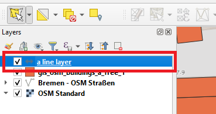
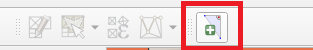
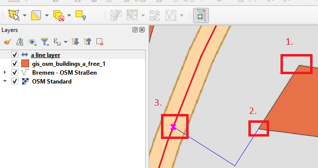
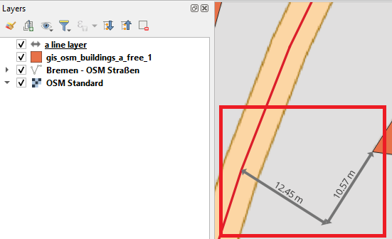

# Manual information
Depends on your Use Case you can draw some lines on a selected layer.

## 1. Select a writable line string layer (can be in edit mode or not)

## 2. Start the Map Tool by clicking on the button

If you have selected an invalid layer, you receive an error message.

## 3. Click on Canvas to define the reference points

You can repeat this action. When you want to deactivate the button, then press the right mouse button or "ESC" on your keyboard.

## 4. Example Result

### Hint
No attribute form will be opened. The features will be just added to the selected line layer without setting attributes.